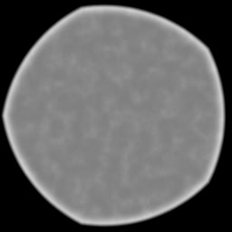
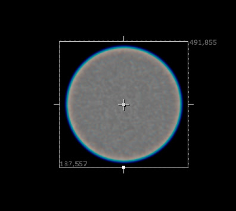

# <i class="fa-solid fa-circle"></i> Bokeh

OpenDefocus has an extensive bokeh creation tool built in. This allows you to easily create realistic looking bokeh shapes.

---
## Shape type
There are three shape types:

1. Simple
2. Disc
3. Bladed
4. Image

### Simple
This does not render anything, for a bit extra performance. It calculates the radius on the fly.

### Disc
This shape does not have any edges and is perfectly circular

### Bladed
This shape allows you to set x number of corners, and adjust its curvature accordingly.

### Image
Use your own kernel and bypass the bokeh creation tool.

> [!WARNING]
> Crop your filter!
> If you use this functionality, make sure to crop the bokeh properly. To not waste any unused pixels. As OpenDefocus uses the bounding box to determine the sampling area.

