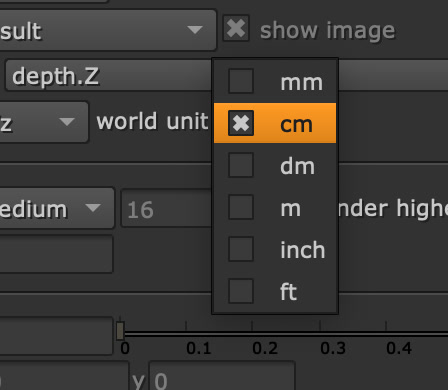

# <i class="fa-solid fa-video"></i> Camera Input
OpenDefocus now supports a camera input for optically accurate defocus. This means that according to the camera settings the defocus would match the result from real life. Using the camera is incredibly easy.

There is no need for any position data. If you want your defocus to match for example a 50mm lens. Just add the filmback and focal length to the lens, and set the `f`-stop to your expected stop.

---

## Connecting the camera
Connecting the camera is done using the `cam` input. When this is connected, OpenDefocus will automatically set the mode to `camera`.

Once connected, you'll notice some options are greyed out. This is because they are now controlled by the camera node.

---

## World unit

It is important to set the world unit the depth map was rendered in. As each pixel in a depth map represents the distance, a value of 10 cm would be a completely different result as it would be if it is 1000cm.

!!! warning annotate "Math"
    As with any depth based defocus, always make sure the **math** is set correctly. Refer to [<i class="fa-solid fa-subscript"></i> Depth math](depth_math.md) for more information.

---

## Controlling the focal plane
There are two options to set the focal plane. By default OpenDefocus will reference the focal plane setting set in the camera. However, if you move the sample point or deactivate the `override by camera` option, you will just be able to set the focal plane using the controls you are used to.

### Using the focus point
Connect the camera just like normal. And now you can drag the focus point from the OpenDefocus node to the point you would like in focus. That's it!

<video src="../assets/camera.mp4" controls="controls" width="100%" loop></video>
>Chart used in this render: http://regex.info/blog/photo-tech/focus-chart

### Using the camera focal distance
Open the camera connected. Listed under the `Projection` tab all controls are available. Set the focal distance to the distance by your world unit, and it will match the result.

This can be especially useful if, for example the matchmove department, already includes focus data.

#### Bonus: 3D View adjustments
When using the 3D view, you will be able to see a dot representing the focal distance in 3D space. This can be useful when you got a matchmove and got a 3d point cloud. Then you could use this point to animate the focus accordingly.

<video src="../assets/focal_plane_camera.webm" controls="controls" width="100%" loop></video>
> Setting the focal distance using the focal distance knob in the camera

---

## I'd like to increase the size of the bokeh
Just as with any real camera, increase or decrease the `f`-stop to change the size of the bokeh. Lowering the `f`-stop will make the bokeh larger, while increasing the `f`-stop will decrease the bokeh size.

Make sure to set the maximum size on the OpenDefocus node to the size you want to define as a maximum, as no value will go higher than that.