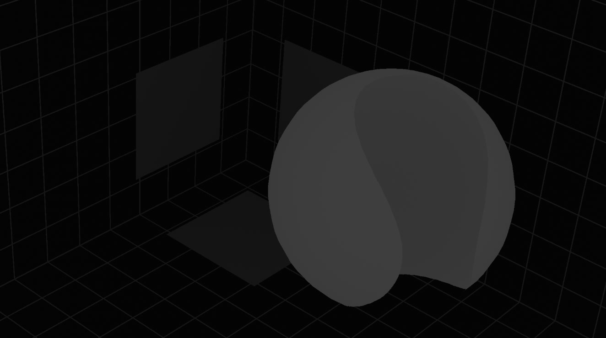
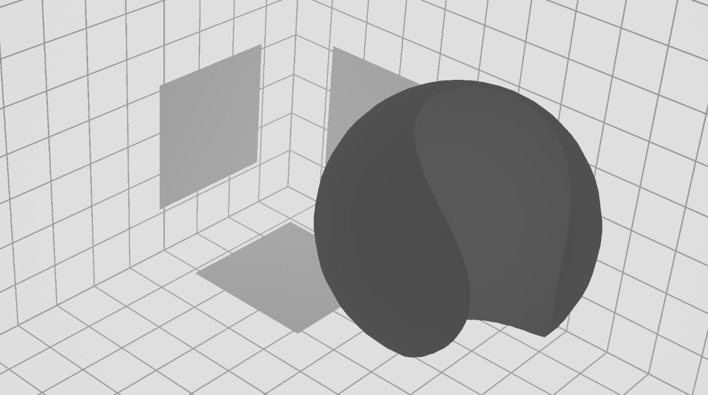

# <i class="fa-solid fa-subscript"></i> Depth math
The math option is important when using depth based defocus, and should be the first thing to set-up correctly when starting the node.

The math option allows you to define what kind of depth map is being given to the OpenDefocus node.

There are three options available, all which will be explained here.

---
## 1/z
This is a depth map that is being rendered by both the ScanlineRenderer as RenderMan. The brighter the value, the closer it is to the camera. These values are always between 0 and 1.

---

## Real
This is a depth map being rendered by other render engines, this is the most common depth map. The value in a specific pixel is the distance in the world unit from the render engine.

---

## Direct
This is an option allowing you to provide any values directly to OpenDefocus to define the size of the bokeh in pixels. If you provide a value of 20 on a specific pixel, it will be defocussed by a size of 20.

It is also possible to define far and near field. Any value in the negative values will be defined as in the far field, while any values in the positive will be defined as in the near field.

> [!IMPORTANT]
> While the direct map defines the `size`, it does not define the `max size`. Set your max size according to your expected or wished maximum value.