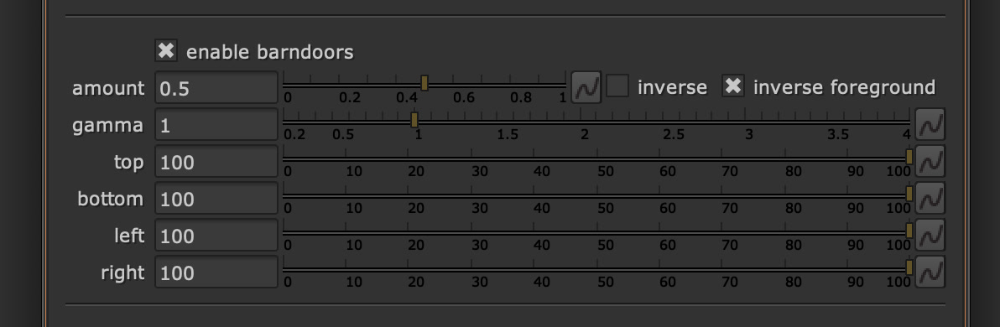

# <i class="fa-solid fa-door-open"></i> Barndoors

Barndoors, or also called *matte box*, are physically attached doors to the lens, which allow the camera operator to block incoming light. This is often done to prevent lens flares from occurring. 

---

## Example of effect
Take a closer look at the edges of the image. Compare the center bokeh to the edge and notice how it gets the cat-eyed shape.

<video src="../../assets/barndoors_animated.webm" controls="controls" width="100%" loop></video>

## Why do they occur?
This is happening because the matte box/barndoors is attached to the lens and is blocking light from entering. It is identical to [<i class="fa-solid fa-cat"></i> Catseye](./catseye.md), but the shape is different because a matte box is straight and not in a circle shape like a lens.

---

### Barndoors on lens attached
Best example is to look this image and notice how this would block light rays from entering the lens.

> By Reinis Traidas - reinn - https://www.flickr.com/photos/reinis/398614200/, CC BY 2.0, https://commons.wikimedia.org/w/index.php?curid=4642883

---

## Controlling each side individually

As you can see in the barndoors image, there could be four doors to control. This is top, bottom, left and right. With OpenDefocus you can control these individually in the controls of the barndoors.

