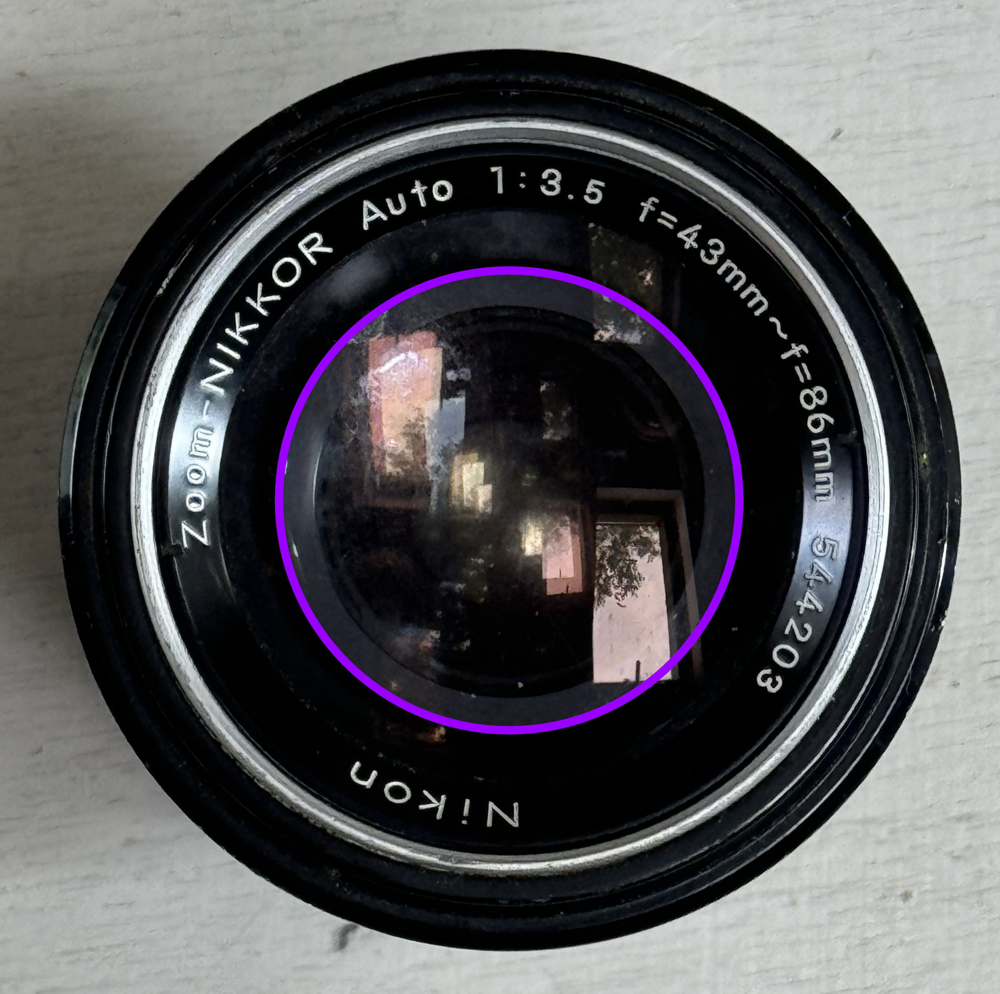
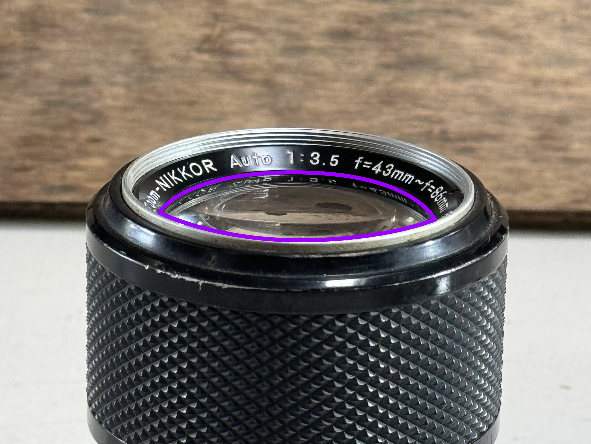

# <i class="fa-solid fa-cat"></i> Catseye

Catseye is a non uniform lens artifact that creates "cat-eyed" bokeh shapes at the edge of your image. Besides catseye, it is also called *swirly bokeh*, *mechanical vignetting* and *optical vignetting*.

---

## Example image of effect
Take a closer look at the edges of the image. Compare the center bokeh to the edge and notice how it gets the cat-eyed shape.

---

## Why do they occur?
This is a combination of the type of lens used and the angle of the light rays entering the lens. Best example is by looking at a real lens.

> Imagine the point of the photo is a lightray entering the lens. Look at how the shape of the circle changes when looking at an angle at the lens. There is a portion of the lens which is not visible anymore.
