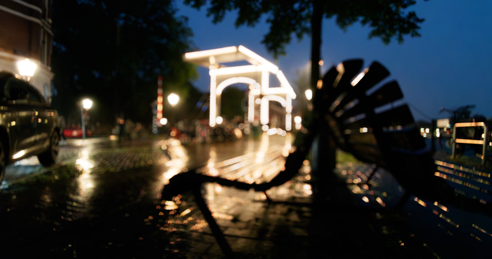

# <i class="fa-solid fa-shapes"></i> Non uniform

No lens is perfect, although lens manufactures get pretty close. While they try to make a lens as perfect as possible, in Visual Effects we try to replicate as many things possible. Including lens artifacts.

Replicating these things as close as possible to the real lenses makes an image from feeling CG to feeling authentic and real.

> Example of image with lens artifacts replicated, especially notice the corners of the image. No single bokeh is the same across the image.

Non uniform is a broader term describing defocus artifacts that occur not at an image level, but on a per-bokeh basis. This mostly is dependant on these three factors:

* `xy` position
* focal distance
* distance of point to camera

---

## OpenDefocus included non uniform lens effects
OpenDefocus includes all kinds of non-uniform lens effects (artifacts) that you can replicate. All of these are documented here. Click the link to get more information about how these artifacts occur:

* [<i class="fa-solid fa-cat"></i> Catseye](./catseye.md)
* [<i class="fa-solid fa-door-open"></i> Barndoors](./barndoors.md)
* [<i class="fa-solid fa-expand"></i> Astigmatism](./astigmatism.md)
* [<i class="fa-solid fa-down-left-and-up-right-to-center"></i> Axial aberration](./axial_aberration.md)
* [<i class="fa-solid fa-circle-half-stroke"></i> Inverse foreground](./inverse_foreground.md)

