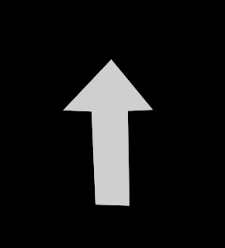

# <i class="fa-solid fa-circle-half-stroke"></i> Inverse foreground
On most of the non uniform artifacts there is a checkbox checked by default. This is called `inverse foreground`. Also there is the `inverse` checkbox. This is caused by the way light rays work physically.

---

## Visual explanation
When adjusting the focus, you are adjusting the position where lights intersect, and form a sharp image at that location. This is shown in the video added below:
<video src="../../assets/focus_changing.webm" controls="controls" width="100%" loop></video>
> Blue is the far field, red is the near field.

The point where the lines collide is the point of focus. Notice that once they collided, they still continue in a straight line. This causes the light rays to be in an inverse order.

This is exactly the reason why optical artifacts inverse in the foreground in contrast to the far field: the light rays are in inversed order.

## Example image
In this image the following kernel is being provided (thank you for noticing my artistic skills):

When this is provided to OpenDefocus, and it has the `inverse foreground bokeh shape` knob enabled, it'll inverse the shape in foreground in opposite direction of the background:

> Background and foreground in focus

