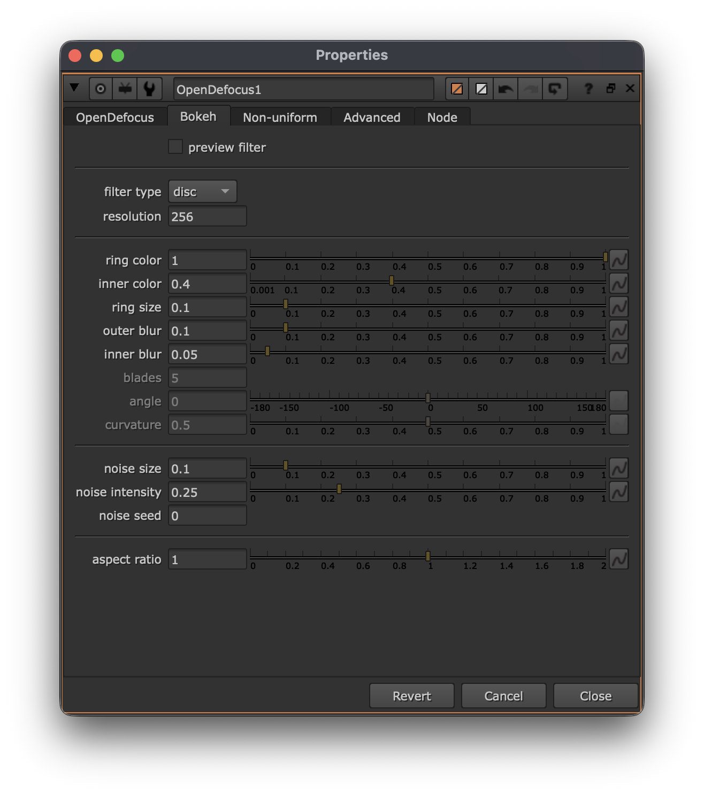
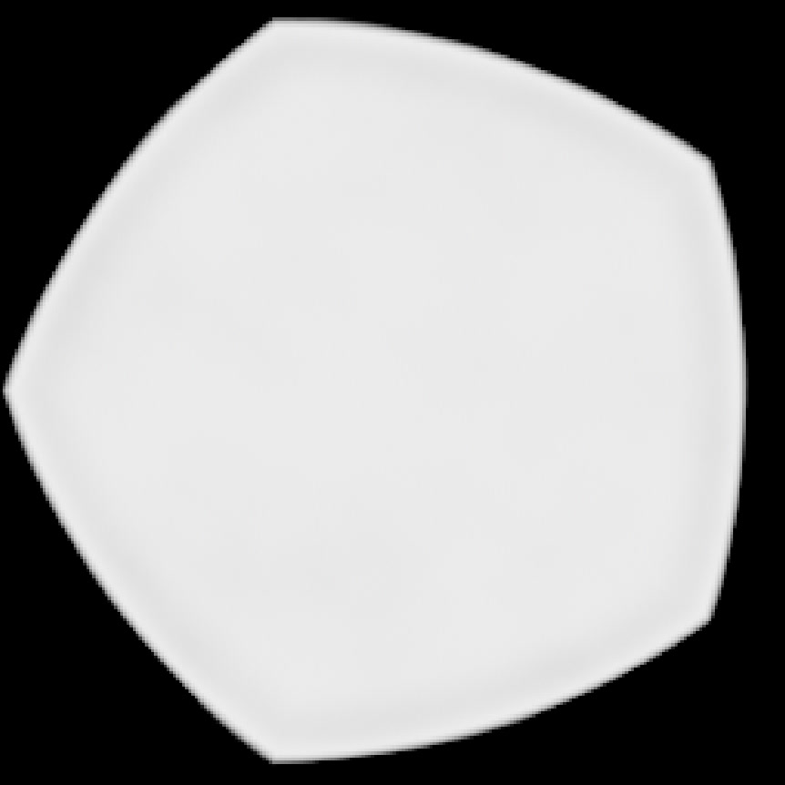
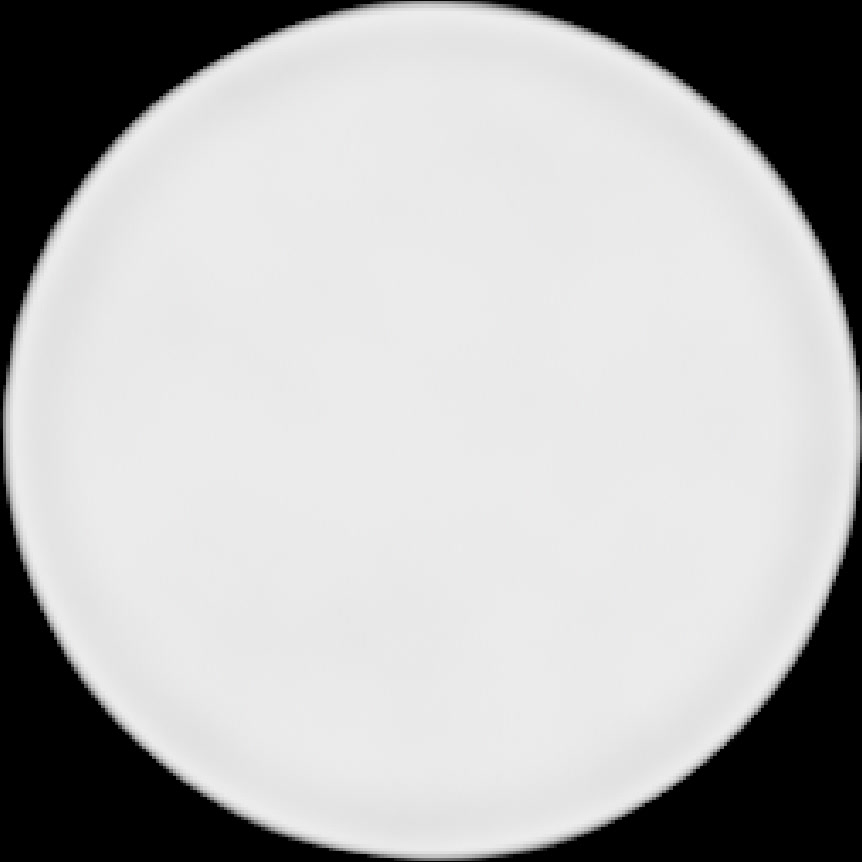

# <i class="fa-solid fa-circle"></i> Bokeh

## Bokeh tab
OpenDefocus includes an easy to use and extended bokeh tab. Allowing you to create any bokeh you'd like.

You can find the settings under the tab `Bokeh`.

> [!TIP]
> To see what you are actually doing it is the easiest to select the `preview filter` checkbox and see what the changes to to the kernel.

---

### Filter type
The filter type defines the shape creation. You can select disc for a circle. Bladed is selected by default and sets the bokeh in a shape similar to the `f`-stop blades.

The other option is image, and will be automatically selected if you connect the filter input to an image. This image can be any size.

---

#### Custom image input bounding box
It is important that the filter input bounding box is cropped to the region of the bokeh, as this defines the sampling patttern for the defocus result, which improves quality massively.

---

#### Bladed
When bladed is selected, the blades will be defined by the `blades` knob. The sharpness is defined by the `curvature` knob. Setting a value to 1 will make it entirely circular. Setting the value to 0 will make the corners sharp.

> Curvature comparison, curvature 0 and curvature 1

---

