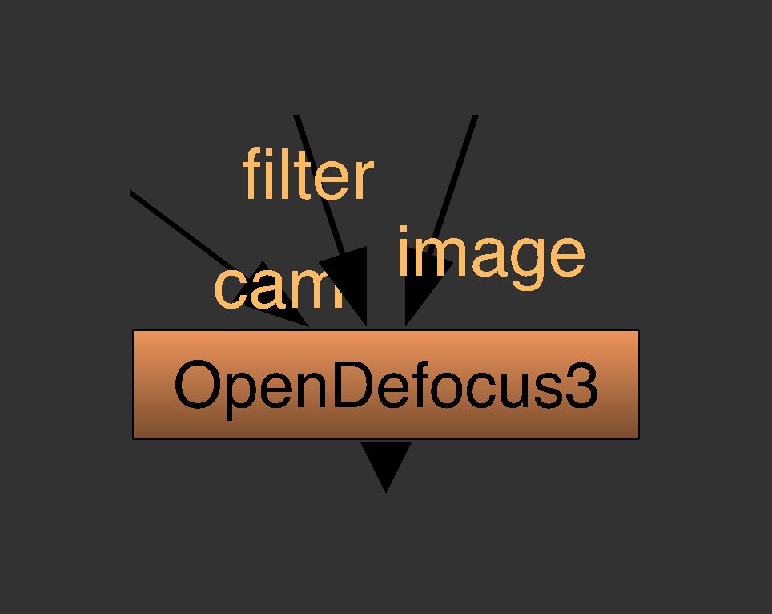

# <i class="fa-solid fa-box"></i> Inputs

If you create the OpenDefocus node, you'll notice 3 inputs.

1. image: this is the input image that you want to defocus.
2. filter (optional): this is a bokeh kernel/filter that you want to use for applying the defocus
3. cam (optional): use this camera input to apply an optically accurate defocus according to the camera settings ([<i class="fa-solid fa-video"></i> Camera Input](../detailed/camera_input.md))

---
