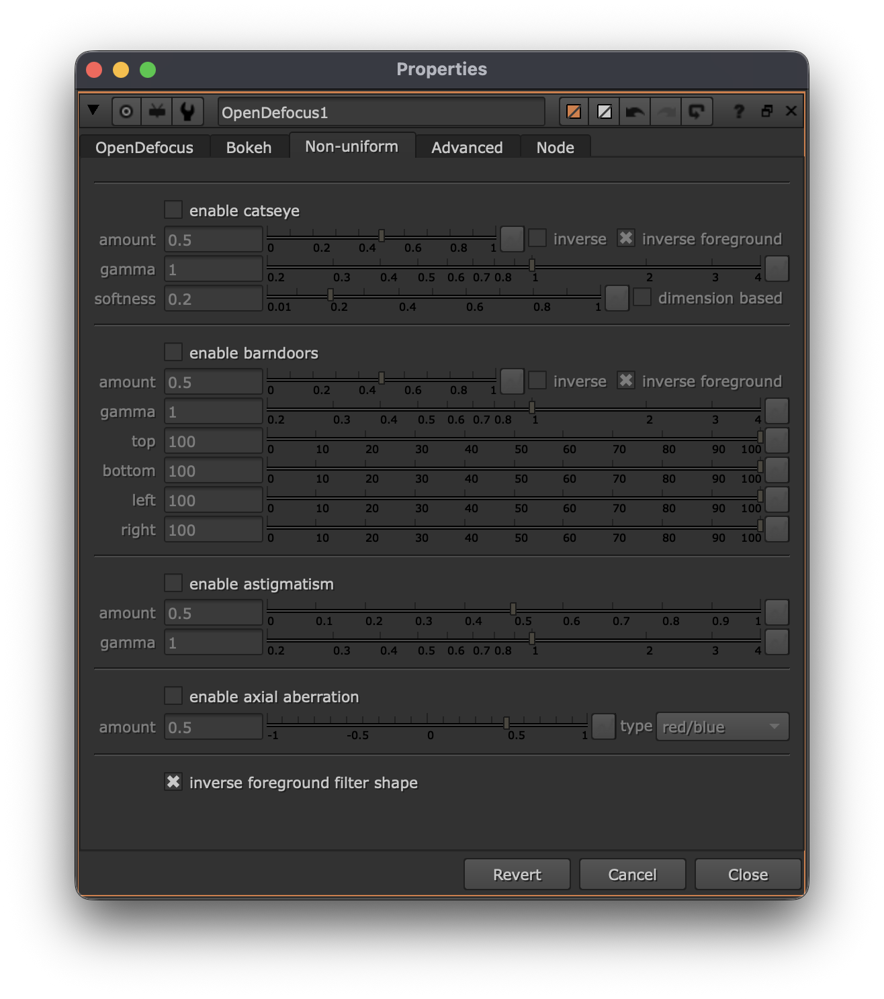

# <i class="fa-solid fa-shapes"></i> Non uniform

The non-uniform tab is responsible for any effects that are unique depending on their depth and position on screen. This can be a cutting, cropping, scaling, etc. effect.

This is where it gets really fun. There are now more effects than ever, including effects that were technically not possible at all before.

For a detailed technical explanations about these effects, like how they occur physically, I'd refer you to the [<i class="fa-solid fa-shapes"></i> Non uniform](../detailed/non_uniform/index.md) page.

Each effect has its own section. Pressing the enable checkbox will make it possible to make adjustments to the specific non uniform feature.

---

## Catseye
[<i class="fa-solid fa-cat"></i> Catseye](../detailed/non_uniform/catseye.md) is an effect that cuts the bokeh by itself depending on the position. It is not visible in the center, but most visible in the edges.

---

## Barndoors
[<i class="fa-solid fa-door-open"></i> Barndoors](../detailed/non_uniform/barndoors.md) is an effect that occurs when light is blocked by a barndoor/flare. This is attached to the lens itself.

With OpenDefocus all sides can be controlled uniquely.
<video src="../assets/barndoors_animated.webm" controls="controls" width="100%" loop></video>

---

## Astigmatism
Bokehs can appear stretched at the corners, this is called [<i class="fa-solid fa-expand"></i> Astigmatism](../detailed/non_uniform/astigmatism.md) in lens terms (note: eye astigmatism is something different).

---

## Axial aberration
[<i class="fa-solid fa-down-left-and-up-right-to-center"></i> Axial aberration](../detailed/non_uniform/axial_aberration.md) is affected by light rays not entering the lens the same way depending on the focus distance. Instead of regular chromatic aberration that shifts the edges of the image, this is on a bokeh level.

> Focus on foreground and background, notice the shift from red on the outside to blue on the outside of the bokeh.

It is also possible to change the color combination. All the options are:

* red/blue
* green/purple
* blue/yellow

---

## Inverse bokeh shape in foreground
This effect is enabled by default. In this image an arrow shapes kernel is used. Notice how the arrow points up in the background and down in the foreground. This is caused by light rays traversing once they've hit the sensor. This is present on all lenses/cameras.

> Background and foreground in focus

---

## Non uniform stacking
All the effects can be combined, this allows you to create some really unique and optical results.

---

## Inverse non uniform in foreground
This is another new feature, which is optically accurate. This is a technical story so the explanation can be found on the [<i class="fa-solid fa-circle-half-stroke"></i> Inverse foreground](../detailed/non_uniform/inverse_foreground.md). However, in simple terms it means the light rays inverse in the foreground with respect to the background.

What happens visually, is the following:

>In the first image, everything is out of focus. In the second image the foreground is now in the out of focus, but in the foreground, and the background is in focus. Notice how the non uniform shapes across the edges of the image are inversed.

