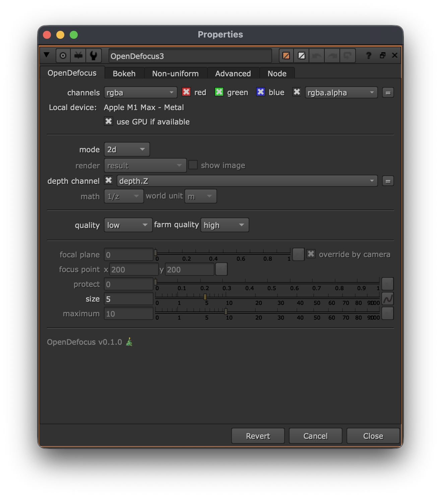

# <i class="fa-solid fa-gears"></i> Options

The defocus tab is responsible for having the defocus settings, applying focus, setting sizes, setting modes, etc.

When you open the node, you will see the *main* a.k.a. *defocus* tab. See the image below:

The most important options are:

* mode: the mode to apply the defocus. Either *2D*, *depth* or *camera*
* math: only when performing depth based defocus, define the type of depth map being used. ([<i class="fa-solid fa-subscript"></i> Depth math](../detailed/depth_math.md))
* size: the size of the defocus in pixels.
* focus plane (C): define the point of focus, comparable to focussing on a real lens.
* maximum: when using depth, this will define the maximum defocus value ([<i class="fa-solid fa-bullseye"></i> Defocus size](../detailed/defocus_size.md)).

These controls are made as similar as possible to existing tools, to make it easy to adapt it in your workflow.
