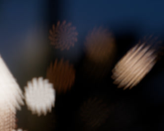

# <i class="fa-solid fa-star"></i> Quality

This is a feature that makes it possible for *OpenDefocus* to render complicated shapes but having a fast preview.

> [!TIP]
> You could compare it to a sample setting in a [ScanlineRender](https://learn.foundry.com/nuke/content/reference_guide/3d_nodes/scanlinerender.html) node for example.
>
> Lots of motion <i class="fa-solid fa-arrow-right"></i> increase samples == large bokehs <i class="fa-solid fa-arrow-right"></i> increase quality

It is recommended to set the quality to medium or low during compositing work. When sending it to a render farm, it will render in high quality automatically.

> Quality settings, first to last from low to high.

---
